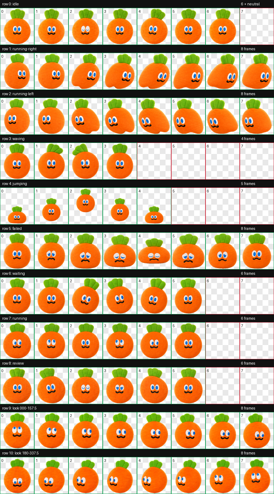

# 卜卜 · Codex 宠物

「卜卜」是一只圆滚滚、软乎乎的橙色萝卜 Codex 宠物，包含 9 组标准状态动画和 16 个视线方向。

## 下载

推荐从 [Releases](https://github.com/chenjie1129/maydaylove/releases/latest) 下载 `bubu-carrot-codex-pet.zip`。

也可以直接下载本仓库的 `bubu-carrot` 文件夹，其中必须同时保留：

- `pet.json`
- `spritesheet.webp`

## 安装

1. 退出 Codex。
2. 将整个 `bubu-carrot` 文件夹复制到宠物目录：
   - macOS / Linux：`~/.codex/pets/`
   - Windows：`%USERPROFILE%\.codex\pets\`
3. 确认最终路径中同时存在 `bubu-carrot/pet.json` 和 `bubu-carrot/spritesheet.webp`。
4. 重新启动 Codex。

## 规格与验证

- Codex 宠物协议：v2
- 图集：8 × 11，1536 × 2288
- 单格：192 × 208
- 格式：RGBA WebP
- 图集结构、透明背景和方向语义均已完成校验

## 使用范围

本仓库用于朋友间的个人、非商业分享。请阅读 [NOTICE.md](NOTICE.md)。
